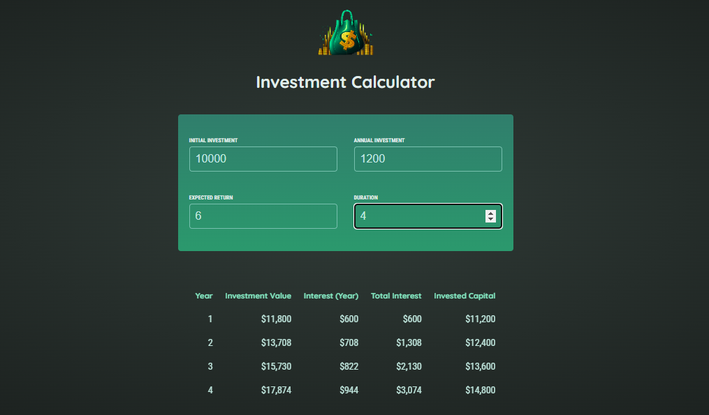

# reactProjects

# 1. Basic concept Building 
# Learnt components , state and .jsx coding
# 
# 

# 2. Basic concept Building 
# Learnt State lifting and .jsx coding
# 
# 
# 

# 3. Basic concept Building 
# Learnt State lifting and .jsx coding
# 

